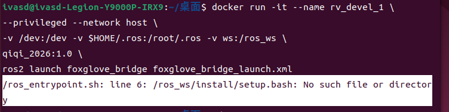

### 1. 在已知的路径下创建一个文件夹用来安放Dockerfile文件
```bash
#如果放在主目录下的话
mkdir QIQI_2026
nano Dockerfile
```
### 2. 在Dockerfile中写入以下内容
```bash
FROM ros:humble-ros-base

# create workspace
RUN mkdir /ros_ws/
WORKDIR /ros_ws/

# install some dependencies and some tools
RUN apt-get update && rosdep install --from-paths src --ignore-src -r -y && \
    apt-get install ros-humble-foxglove-bridge wget htop vim -y && \
    rm -rf /var/lib/apt/lists/*

# setup zsh
RUN sh -c "$(wget -O- https://github.com/deluan/zsh-in-docker/releases/download/v1.1.2/zsh-in-docker.sh)" -- \
    -t jispwoso -p git \
    -p https://github.com/zsh-users/zsh-autosuggestions \
    -p https://github.com/zsh-users/zsh-syntax-highlighting && \
    chsh -s /bin/zsh && \
    rm -rf /var/lib/apt/lists/*

# setup .zshrc
RUN echo 'export TERM=xterm-256color\n\
eval "$(register-python-argcomplete3 ros2)"\n\
eval "$(register-python-argcomplete3 colcon)"\n'\
>> /root/.zshrc
```
### 3. 用Dockerfile构建一个镜像
```bash
docker build -t qiqi_2026
```
### 4. 用镜像构建开发容器用于配置环境
```bash
run -it --name rv_devel_1 \
--privileged --network host \
#下一行为各种挂载，配置环境暂不需要
# -v /dev:/dev -v $HOME/.ros:/root/.ros -v ws:/ros_ws \
qiqi_2026:1.0 \
#ros2 launch foxglove_bridge foxglove_bridge_launch.xml
```
### 5.把src文件夹手动放置在/ros_ws/目录下，配置容器环境
### 6. 编译运行成功后，在容器中ros_entrypoint.sh文件第6行写入
```bash
source "/ros_ws/install/setup.bash"
```
### 容器中.zshrc文件最后一行写入
```bash
source /ros_ws/install/setup.zsh
```
### 7. 用配好环境的容器生成镜像
```bash
# docker commit -m=“提交的描述信息” -a=“作者” 容器ID 目标镜像名:[标签名]
docker commit -m="fyt_autoaim code environment" -a="nmh" 容器ID qiqi_2026:2.0
```
### 8. 镜像导出为压缩包
```bash
docker save qiqi_2026:2.0 > qiqi_2026.tar
```
### 9. 其他计算机镜像导入
```bash
docker load < qiqi_2026.tar
```
### 10. 构建开发容器
```bash
docker run -it --name rv_devel \
--privileged --network host \
-v /dev:/dev -v $HOME/.ros:/root/.ros -v ws:/ros_ws \
qiqi_2026:2.0 \
ros2 launch foxglove_bridge foxglove_bridge_launch.xml
```
### 构建运行容器
```bash
docker run -it --name rv_runtime \
--privileged --network host --restart always \
-v /dev:/dev -v $HOME/.ros:/root/.ros -v ws:/ros_ws \
qiqi_2026:3.0 \
ros2 launch rm_bringup bringup.launch.py
```
### 11. （构建容器报错）  

### 可以试试先运行这个（容器工作空间卷删除指令）
```bash
docker volume rm ws
```
### 删除没有完全构建成功的容器后（如果有的话）重新运行构建容器命令